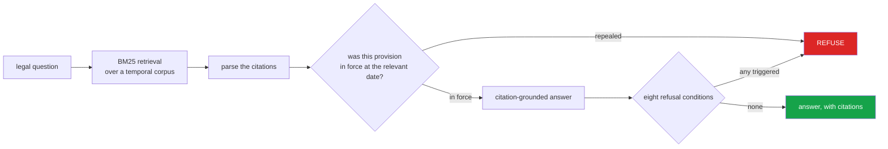

<h1 align="center">pak-law-assistant (Python · BM25 · temporal validity graph)</h1>
<p align="center"><i>Legal question answering over Pakistani statutes that will not cite a repealed provision</i></p>

<!-- mcp-name: io.github.hammasbuilds/pak-law-assistant -->

<p align="center">
  <a href="#the-failure-this-exists-to-prevent">The failure it prevents</a> &middot;
  <a href="#seven-refusal-conditions">Seven refusals</a> &middot;
  <a href="#citation-parsing">Citation parsing</a> &middot;
  <a href="#why-bm25-and-not-embeddings">Why BM25</a> &middot;
  <a href="#amendment-history-is-often-the-question-itself">Amendment history</a> &middot;
  <a href="#install">Install</a> &middot;
  <a href="#as-an-mcp-server">MCP server</a> &middot;
  <a href="#problems-hit-while-building-this">Problems hit</a>
</p>

<p align="center">
  <a href="https://github.com/hammasbuilds/pak-law-assistant/actions/workflows/ci.yml"></a>
  
  
  
  
  <a href="LICENSE"></a>
</p>

---

## Install

No dependencies, so nothing to resolve:

```bash
pip install -e .          # or: uvx pak-law-assistant  (once released)
paklaw-mcp --check        # the MCP server answers, on a 3-provision sample
```

Add it to an MCP client — Claude Code, or anything that speaks the protocol:

```json
{
  "mcpServers": {
    "pak-law": {
      "command": "paklaw-mcp",
      "env": { "PAKLAW_CORPUS": "/path/to/statutes.jsonl" }
    }
  }
}
```

Without `PAKLAW_CORPUS` it runs on a three-provision demonstration sample and says so in
every result. Build a real corpus with `paklaw-corpus import`; the full walk-through is in
[Run it yourself](#run-it-yourself).

## The failure this exists to prevent



**Citing a repealed provision is worse than refusing to answer.** The corpus is temporal,
so "what does the law say" is always resolved as "what did the law say *on this date*".


Ask a normal RAG system *"what is the punishment under section 20 PECA?"* and it
retrieves the text of section 20, which is confident, specific, correctly cited — and
possibly describes a provision that was **substituted in 2022**.

A repealed section reads exactly like a live one. Nothing in the text says otherwise.
Only the corpus knows, and only if it was built to.

That is worse than refusing, because a refusal makes someone check and a confident
citation does not. Here is the same question, twice:

```python
assistant.answer("punishment under section 20 PECA", as_of="2026-09-11")
→ Section 20 PECA  (2022-02-20 → current)
  "...imprisonment which may extend to five years."

assistant.answer("punishment under section 20 PECA", as_of="2018-01-01")
→ Section 20 PECA  (2016-08-19 → 2022-02-20)
  "...imprisonment which may extend to three years."
```

**A flat corpus answers both identically, and one of those answers is wrong.**

Every provision carries the dates it was in force. Retrieval is always *as of* a date —
there is no way to search without supplying one, because an optional date parameter
gets a default and the default eventually gets used for a question where it is wrong.

Superseded text is **retained, not deleted**. Questions about past conduct are asked
against the law as it then stood, and deleting history makes those unanswerable.

## Seven refusal conditions

Each exists because the alternative is an answer that is confident and wrong. The first
four were the original design; the last three were added after an independent review got
a wrong answer out of each of them.

| | What it prevents | `refusal_status` |
|---|---|---|
| No provision found | A plausible-sounding answer with no citation | `nothing_matched` |
| **Provision not in force** | An authoritative-looking answer about repealed law | `not_in_force` |
| Weak match | The nearest provision returned as though it were relevant | `weak_match` |
| Cited provision unknown | Answering about a *different* section because it scored well | `unknown_provision` |
| No Act named | "section 9" of what? Guessing could answer about the wrong law | `no_act_named` |
| **Act not recognised** | "Section 302 of the Indian Penal Code" certified as Pakistani law | `act_not_recognised` |
| **Different offence** | Answering "attempt to murder" with the murder provision | `different_offence` |

Every refusal carries `refusal_status` as well as prose, so a client can branch on the
kind without matching on wording that will be reworded.

A question that **names** a provision is a lookup, not a search. Returning the nearest
match to a citation the user spelled out is how a system answers about the wrong law.

## Citation parsing

Legal writing is citation-dense and precise, and the same provision appears in many
written forms. They must all resolve to one key, or retrieval silently treats them as
different provisions:

```
Section 302 PPC   ·   s. 302 of the Pakistan Penal Code   ·   sec 302, P.P.C.   ·   §302 PPC
                            →  all four:  PPC:section:302
```

Three families, because Pakistani legal argument uses all three:

| | Example |
|---|---|
| **statutory** | `Section 302 PPC`, `Article 25 of the Constitution`, `Order XXXIX Rule 1 CPC` |
| **subordinate** | `SRO 1125(I)/2011` |
| **reported** | `PLD 2015 SC 401`, `2019 SCMR 1234` |

Reported citations matter because a statute's *meaning* frequently lives in the case law
rather than the text. `Order XXXIX Rule 1` parses as **one** citation, not two — civil
procedure is cited by Order and Rule, and splitting it makes the count of authorities in
an answer wrong.

Urdu and Roman Urdu citations resolve to the same keys: `دفعہ 302 تعزیرات پاکستان`,
`دفعہ ۳۰۲ تعزیرات پاکستان` (Urdu digits), `dafa 302 PPC` and `آرٹیکل 25 آئین`. Common
names work too: `Penal Code`, `Criminal Procedure Code`, `ضابطہ فوجداری`.

A bare `section 9` gets **no** statute. Context can supply one explicitly, but it is
never guessed: attributing a provision to the wrong Act produces something that looks
exactly like a correct answer.

## Why BM25 and not embeddings

A considered choice for this corpus, not a shortcut.

- **Legal text is terminology-bound.** *"Reasonable apprehension of death"* is a term of
  art. A semantically similar paraphrase is a different provision, and retrieving it is
  a wrong answer. Embeddings are good at paraphrase — the wrong strength here.
- **It is inspectable.** Asked why a provision was returned: *"these terms matched with
  these weights"* is an answer a lawyer can check. *"It was close in a 384-dimensional
  space"* is not, and in a domain where reasoning must be auditable that decides it.

Section numbers are kept as tokens — `302` is among the most discriminating terms in a
penal code — and boosted, so matching a number outranks matching prose. Legal stopwords
(`shall`, `section`, `act`, `person`, `whoever`, `commits`) are dropped, since nearly
every provision contains them, and so are question words (`what`, `can`, `my`).

**A match must cover the question, not just score.** The nearest provision is refused
unless it contains more than half of the question's content words. With a score
threshold alone, *"Whoever commits theft"* was answered with the murder section, on
the strength of two words every penal provision contains. The refusal names the words
that were missing.

## Amendment history is often the question itself

```python
assistant.history("section 20 PECA")
# {"versions": 2, "currently_in_force": True,
#  "history": [{"from": "2016-08-19", "to": "2022-02-20",
#               "manner": "substituted", "amended_by": "Ordinance II of 2022"},
#              {"from": "2022-02-20", "to": None, "manner": "in force"}]}
```

*"When did this change?"* is asked constantly — about conduct that occurred before an
amendment, about which version governs a pending case — and it is **unanswerable from a
flat corpus**.

---

## Input


## Output

`python demo.py`


*Questions 1 and 2 are the same sentence. The only difference is the date they are about,
and it changes the answer from five years and ten million rupees to three years and one
million. A flat corpus returns one of these and cannot tell you which. Question 3 is
refused rather than answered from the nearest-looking provision.*

---

## As an MCP server

The same library, exposed to Claude Desktop, Claude Code or any other
[Model Context Protocol](https://modelcontextprotocol.io) client as **eight read-only
tools**. It still has zero dependencies: the server implements the stdio transport
directly (newline-delimited JSON-RPC) instead of pulling in an SDK. Every tool was called
through the official Python SDK client (`mcp` 2.2.0), and the suite drives the server
byte by byte over a pipe — including as a real subprocess, and including a check that
each tool's structured result matches the `outputSchema` it declares.

| Tool | Use it for |
|---|---|
| `answer_question` | "what does the law say about X *on this date*": provision text with citations, or one of the eight refusals |
| `check_citations` | **auditing a draft** (a brief, a notice, or a model's own answer). Every citation gets a status for the date: `in_force`, `amended_since`, `not_in_force`, `not_yet_in_force`, `unknown_provision`, `no_act_named`, `statute_not_loaded`, `not_checkable` or `before_record` (dated before the corpus starts recording that statute), plus its character offset |
| `provision_history` | "when did section 20 change?": every version, how each one ended, and the instrument on each side |
| `compare_versions` | "what did the amendment do?": a word-level diff between the text on two dates |
| `list_provisions` | a statute's table of contents on a date, in statute order (2 < 10 < 10A), paged |
| `changes_between` | every commencement, substitution, omission and repeal in a period |
| `parse_citations` | turns `s. 302 of the Pakistan Penal Code`, `§302 PPC` and `sec 302, P.P.C.` into one key; handles Order/Rule, SROs, PLD/SCMR/CLC. Needs no corpus |
| `corpus_info` | what is loaded, so the model knows what it *cannot* answer |

Choices that make it more than a thin wrapper:

- **Every date is required.** The Python API defaults `as_of` to today. A model calling a
  tool leaves optional arguments empty, and the questions that most need a past date
  (conduct before an amendment) are exactly the ones where today is wrong.
- **There is no search tool.** Raw BM25 hits are always the *nearest* provisions, relevant
  or not, and a model handed a ranked list cites the top one. The only route to retrieval
  is `answer_question`, which can refuse.
- **`check_citations` reports `all_in_force` only if every citation was actually checked.**
  The verdict is `problems` (something cited was not law on the date), then `review`
  (a citation was good law on the date but has been amended since, so the draft may be
  quoting the later words), then `unverified` (case law, SROs, an Act that isn't loaded,
  or no citations at all), and only then `all_in_force`.
- **Citations are read the way Pakistani lawyers write them:** `302-B`, `489-F`, `u/s 302`,
  `sections 302/34 PPC`, `302 PPC`, `Article 17 QSO`. They are also *not* read where they
  aren't: `Rs. 500` is not section 500, and `Part 3` is not Article 3.
- **A citation that can't be answered is named, never dropped.** Ask about three sections
  and get one, and the other two appear in `warnings` with the reason.
- **Big results are paged** (`offset` and `next_offset`, with `total` always the full
  count), inputs are capped at 200,000 characters, and a 10,000-version corpus answers
  `changes_between` in well under a second.
- **A citation to a subsection finds its section.** `section 20(1) PECA` returns all of
  section 20 with a note saying so, rather than being refused as unknown.
- **A refusal is a normal result** (`refused: true`), so the model treats it as the
  answer. A bad argument such as `as_of="last year"` comes back as a tool error that
  names the format, so the model can correct it and retry.

`python demo_mcp.py` starts the server and calls it over stdio:

```
[1] answer_question(as_of='2026-01-01')   -- asked about today
    Section 20 PECA   in force 2022-02-20 -> present
    ...shall be punished with imprisonment which may extend to five years or with fine which may extend to ten million rupees or with both.

[2] answer_question(as_of='2020-06-01')   -- the same, about 2020
    Section 20 PECA   in force 2016-08-19 -> 2022-02-20
    ...shall be punished with imprisonment which may extend to three years or with fine which may extend to one million rupees or with both.

[3] answer_question(as_of='2015-01-01')   -- before enactment
    REFUSED     the cited provision was not in force on that date: Section 20 PECA — not yet in force on 2015-01-01 (commenced 2016-08-19)

[4] provision_history(citation='s. 20 of the Prevention of Electronic Crimes Act')
    2016-08-19 -> 2022-02-20  substituted  Ordinance II of 2022
    2022-02-20 -> present     in force

[5] compare_versions(citation='section 20 PECA', before='2020-01-01', after='2026-01-01')   -- what the amendment changed
    added     'through any information system,'
    replaced  'three' -> 'five'
    replaced  'one' -> 'ten'

[6] check_citations(as_of='2019-03-01')   -- a draft about 2019 conduct
    amended_since     Section 20(1) PECA in force on 2019-03-01, but amended with effect from 2022-02-20 — check the draft quotes the words in force on its date
    in_force          Article 25 CONST
    not_checkable     PLD 2015 SC 401   case law is not held in this corpus
    unknown_provision Section 21 PECA   PECA has no such provision here
    verdict: problems

[7] answer_question(as_of='last year')   -- a date the model got wrong
    TOOL ERROR  as_of must be a date as YYYY-MM-DD, got 'last year'
```

*Call 6 is the case the audit exists for.* The draft is about conduct in 2019 but quotes
"up to five years", which is the post-2022 penalty. The citation itself was valid in
2019, so a check that only asks whether section 20 existed would pass it. The audit
gives it its own status, `amended_since`, and it would hold the verdict at `review` even
if the other citations were clean.

### Connect it

Install it, then point your client at the `paklaw-mcp` command:

```bash
pip install git+https://github.com/hammasbuilds/pak-law-assistant
paklaw-mcp --check                       # prints what the server will serve, then exits
claude mcp add pak-law -e PAKLAW_CORPUS=/path/to/statutes.jsonl -- paklaw-mcp   # Claude Code
```

Claude Desktop does not inherit your shell's `PATH`, so either give it the **full path**
to `paklaw-mcp` (`where paklaw-mcp` on Windows, `which paklaw-mcp` elsewhere), or let
`uvx` fetch and run it without installing anything. In `claude_desktop_config.json`:

```json
{
  "mcpServers": {
    "pak-law": {
      "command": "uvx",
      "args": ["--from", "git+https://github.com/hammasbuilds/pak-law-assistant", "paklaw-mcp"],
      "env": { "PAKLAW_CORPUS": "/path/to/statutes.jsonl" }
    }
  }
}
```

On Windows write the corpus path with forward slashes or doubled backslashes
(`"C:/law/statutes.jsonl"`), since a single backslash is an escape in JSON. Leave
`PAKLAW_CORPUS` out to try the three-provision sample first.

Once the package is on PyPI the same server starts with `uvx pak-law-assistant` (the
package also installs a `pak-law-assistant` command for exactly this), which is how MCP
registry clients run it; `server.json` is its
[MCP Registry](https://registry.modelcontextprotocol.io) manifest.

| Setting | |
|---|---|
| `PAKLAW_CORPUS` | path to the corpus file. The only configuration there is |
| network | none; the server never opens a socket or makes an outbound request |
| writes | none; every tool is read-only, and the corpus is changed only by `paklaw-corpus`, never by the model |

### Building a corpus: `paklaw-corpus`

No statute text ships with this repo (see [Limits](#limits)). `paklaw-corpus` builds a
corpus from an Act's official text and records amendments. It checks that every
version's dates line up, so a corpus the server would refuse is never written.

```bash
# split an Act's text into provisions ("20. Heading.—(1) Whoever ...")
paklaw-corpus import peca_2016.txt --statute PECA --in-force-from 2016-08-19 -o statutes.jsonl

# record amendments: each one closes the live version and opens the next on the same date
paklaw-corpus substitute statutes.jsonl "section 20 PECA" --on 2022-02-20 \
    --by "Ordinance II of 2022" --text-file s20_amended.txt
paklaw-corpus insert statutes.jsonl "section 26A PECA" --on 2025-01-29 \
    --by "Act I of 2025" --heading "..." --text-file s26a.txt
paklaw-corpus repeal statutes.jsonl "section 3 PECA" --on 2024-01-01 --by "..."

paklaw-corpus check statutes.jsonl      # the same validation the server runs at start
```

The Constitution and the Qanun-e-Shahadat Order are numbered in articles, and `import`
stores them that way (`--unit` overrides it). A corpus that holds either as *sections* is
refused at load, because `Article 6` would then find nothing.

`import` reads plain text by default. For the two public sources, say which one, so page
footers, footnotes and amendment markers are removed before splitting:

```bash
pdftotext -layout ppc.pdf ppc.txt
paklaw-corpus import ppc.txt --source pakistan-code --statute PPC --in-force-from 1860-10-06 -o statutes.jsonl
paklaw-corpus import ppc.html --source pakistani-org --statute PPC --in-force-from 1860-10-06 -o statutes.jsonl
```

A corpus file may start with one header line, `{"_corpus": {"as_at": "2025-06-30", ...}}`,
saying when it was last brought up to date. A provision row with `"start_known": false`
marks the date as where the corpus's *record* of that statute begins, not a commencement.
Answers dated after `as_at`, or before a statute's record begins, carry a warning, and
`check_citations` gives such a citation `before_record` instead of calling it
`not_yet_in_force`.

The importer's traps are the real ones. A numbered line inside a body (`3. Thirty days:
…` in the middle of section 20) is not accepted as a new section, because its number
doesn't follow the previous one; it is kept as body text and listed in the report. An
omitted section (`4. [Omitted by …]`) ends the section before it and is listed for its
dates to be recorded by hand. Chapter headings label the sections under them and are
kept out of the bodies. Amending a *subsection* on its own is refused: the corpus holds
whole provisions, and a separately stored subsection would sit beside the stale section.

Any Act can be loaded, not just the thirteen the citation parser knows by name. A corpus
holding `PRPA` makes `section 5 PRPA` parse, answer and audit like any other.

### The corpus file

A JSON array, or JSON Lines, of provisions with the same fields as `Provision`:

```json
{"statute": "PECA", "unit": "section", "number": "20", "heading": "Offences against dignity of a natural person",
 "text": "Whoever intentionally and publicly ...", "in_force_from": "2016-08-19", "in_force_to": "2022-02-20",
 "manner": "substituted", "amended_by": "Ordinance II of 2022"}
```

`amended_by` is the instrument that **ended** a version, paired with `manner`.
`enacted_by` is the instrument that **began** one. They are different fields because
reading one as the other attributes a 2016 commencement to a 2022 ordinance, which is a
bug this repo actually had (see below).

The file is **validated before the server accepts a single request**. If versions
overlap, leave a gap, or more than one is live, the server refuses to start and lists
every problem, because otherwise the answer would depend on which version it happened to
read first. An unknown field such as a typo'd `sectoin` names the row it is in.
`paklaw-mcp --check statutes.jsonl` loads and validates a file, prints what it covers, then exits.

Without `PAKLAW_CORPUS`, the server runs on a **three-provision sample** with
illustrative, unofficial wording, and every result carries a `corpus_warning` saying so.

---

## Corpus validation

`corpus.validate()` catches the structural faults that produce wrong answers silently:
overlapping versions (retrieval returns whichever it reaches first, so results are not
reproducible), a version that never ends while another begins, gaps in force, and more
than one live version of a provision.

## Tests

**No dependencies, no corpus download, and no number quoted here** — this paragraph
has said 49, then 226, then 280, each of them true for about a day. `pytest -q` and the
CI badge are the record. What the suite covers:

| Area | What it holds |
|---|---|
| the library | retrieval, answering, the eight refusal conditions |
| the MCP server | the protocol over a pipe, and a check that every tool's `structuredContent` matches its declared `outputSchema` on every path, refusals included |
| corpus building | the importer against real statute layouts from two public sources |
| record coverage | what the corpus does and does not claim to know |
| retrieval quality | 17 questions in a person's words over 26 real provisions, plus **34 paraphrases of the same questions** and **10 real offences the corpus does not hold**. Scored for right, **wrong** and refused: 16 right of 17, 25 right and 1 wrong of 34 paraphrased, and 10 of 10 refused. The paraphrases exist because a benchmark of 17 sentences is a claim about 17 sentences — an independent review re-asked the same corpus in its own words and got 8 confident wrong answers |
| regressions | one per defect an independent review reproduced, each pinned so it cannot come back quietly |

Run them with
`pip install -e .[dev]` then `pytest`, or `uv run pytest`. CI runs them on Python 3.10 to 3.13, then runs both demos.

| Covered | |
|---|---|
| Citations | four written forms → one key, articles, Order+Rule as one, SROs, both law-report orderings, multiple in a sentence, bare sections, subsections |
| Corpus | version on a date, pre-commencement, **boundary belongs to the new version**, history, superseded text retained, impossible intervals, overlap and multi-live detection |
| Retrieval | numbers kept, stopwords dropped, Urdu tokens, ranking, **never returns a repealed provision**, past-date retrieval, explainability, non-negative IDF |
| Answering | **same question, different dates, different answers**, citation lookup vs search, every refusal condition, citation-first rendering, history |
| Corpus building | splitting an Act, **a numbered line inside a body is not a section**, **an omitted section is a boundary**, chapters, substitution/repeal/insert keep dates consistent, a refused amendment leaves the file untouched, atomic writes, the index cache is shared per amendment interval and bounded |
| Regressions | every citation form above, off-topic questions refused, unanswered citations named, filter before cut, `amended_since`, row types checked at load, re-enactment, schedules, null id, misspelt argument, internal error as a tool error, input limit, 10,000-version and 10,000-citation timings |
| Audit | every citation status, `all_in_force` only when everything was checked, amended-after-the-date flagged, repealed-then-reinstated, word-level diff, statute ordering |
| Second review | the Constitution imported as articles and a sectioned one refused, Urdu and Roman Urdu citations, Urdu digits, common Act names, whitespace input, reversed dates reported, protocol 2025-11-25, `server.json` agrees with the package |
| MCP server | every tool called through the protocol, every date required in every schema, version negotiation, notifications get no reply, `as_of` required in the schema, refusal is a result and a bad date is a tool error, no infinite score on the wire, a malformed line does not end the session, batches, **stdout carries only protocol**, a bad corpus exits before serving |

## Limits

- **No corpus ships with this repo.** The Pakistan Code is public and `paklaw-corpus`
  builds one from it, but getting the in-force dates right is the part that matters and
  the part no tool can do for you. The sample provisions in the package and the tests
  are illustrative and unofficial. **Do not rely on them.**
- **The importer was tested on text laid out like Pakistan Code, not on a downloaded
  Act.** pakistancode.gov.pk refused connections and na.gov.pk served about 200 bytes a
  second while this was being built. A real Act's layout may differ from the fixture, so
  read the import report before loading the result.
- A bare `Article 25` is read as the Constitution's, which is what it means in nearly all
  Pakistani writing. An article of any other instrument has to be named (`Article 17 QSO`).
- Relevance is lexical. `transmitting` does not match `transmits`, so a question phrased
  far from the statute's own words can be refused where a reader would have found the
  provision. That errs toward refusing, which is the side this repo chooses to err on.
- Sections are the unit. A subsection citation returns its whole section, and an amended
  subsection has to be recorded as a new text of the whole section.
- Urdu support is tokenisation-level. Full bilingual retrieval needs the Urdu
  normalisation in [`urdu-nlp-toolkit`](https://github.com/hammasbuilds/urdu-nlp-toolkit)
  wired into the analyser — the interface is there, the integration is not.
- Case law is parsed as citations, not ingested as text. Judicial interpretation is
  frequently where the meaning is, and this retrieves statute only.
- No synthesis. Answers are provision text with citations attached; the system quotes
  law, it does not write it. Narrative phrasing belongs on top, given *verified*
  provisions.
- Urdu is parsed in citations (`دفعہ 302 تعزیرات پاکستان`) but a question in Urdu prose
  is only answered when it cites a provision, because the corpus text is English.
- The MCP server speaks **stdio only**, with no HTTP transport. It is a local tool for
  one user's client, not a hosted service. It exposes tools only, no resources or
  prompts, and the corpus is fixed for the life of the process.
- **This is not legal advice**, and a system that produced fluent legal prose would
  invite reliance it has not earned. The dry, citation-first output is deliberate.

## Keywords

legal AI &middot; legal question answering &middot; statutory interpretation &middot; Pakistani law &middot; citation parsing &middot; repealed provisions &middot; temporal corpus &middot; point-in-time law &middot; BM25 &middot; retrieval &middot; grounded generation &middot; refusal conditions &middot; amendment history &middot; legal tech &middot; zero dependencies &middot; MCP server &middot; Model Context Protocol &middot; citation checker

## License

MIT

---

## Run it yourself

```bash
git clone https://github.com/hammasbuilds/pak-law-assistant
cd pak-law-assistant

pip install -e ".[dev]"  # the package has no dependencies; dev adds pytest and ruff
pytest -q                # no corpus download, no network
python demo.py           # the library
python demo_mcp.py       # the same questions through the MCP server
```

```python
from paklaw import Corpus, LawAssistant, Provision

original_text = "... imprisonment which may extend to three years ..."
amended_text = "... imprisonment which may extend to five years ..."

corpus = Corpus()
corpus.add(
    Provision(
        statute="PECA",
        unit="section",
        number="20",
        heading="Offences against dignity of a natural person",
        text=original_text,
        in_force_from="2016-08-19",
        in_force_to="2022-02-20",
        manner="substituted",
        amended_by="Ordinance II of 2022",
    )
)
corpus.add(
    Provision(
        statute="PECA",
        unit="section",
        number="20",
        heading="Offences against dignity of a natural person",
        text=amended_text,
        in_force_from="2022-02-20",
    )
)

print(corpus.validate())  # [] - no overlapping versions, gaps or multiple live versions

a = LawAssistant(corpus=corpus)
print(a.answer("punishment under section 20 PECA", as_of="2026-09-11").render())
print(a.answer("punishment under section 20 PECA", as_of="2018-01-01").render())  # differs
print(a.history("section 20 PECA"))
```

Loading a corpus is your job, and `paklaw-corpus` does the mechanical part (see
[Building a corpus](#building-a-corpus-paklaw-corpus)). The demo provisions in the tests
and the package are **illustrative and not authoritative; do not rely on them.**

## Problems hit while building this

**Provisions were being attributed to no Act at all.** Statute abbreviations were
normalised by stripping a trailing full stop, which turned the lookup key `p.p.c.` into
`p.p.c` — not in the table. So `sec 302, P.P.C.` parsed as section 302 of *nothing*,
while `Section 302 PPC` resolved correctly, and the two forms of one provision were
treated as different provisions by retrieval. *Fixed* by trying both the dotted and
undotted forms, with a test asserting four written variants produce one key.

**`Order XXXIX Rule 1 CPC` parsed as two citations.** Civil procedure is cited by Order
*and* Rule together; splitting it doubles the count of authorities in an answer. *Fixed*
by consuming matched spans so a more specific pattern wins.

**The first design had an optional `as_of` date.** It defaulted to today, which is
correct until someone asks about conduct from 2019 and gets today's law, fluently and
with a correct-looking citation. *Fixed* by making the date mandatory throughout — an
optional parameter gets a default, and the default eventually gets used for a question
where it is wrong.

**A refusal gave the wrong enactment date, which only showed up once the MCP server made
it easy to ask.** When asked about section 20 PECA as of 2015, it refused correctly, but
said the section *"commenced 2022-02-20"*. It was enacted in 2016, and 2022 is when it was
substituted. The refusal always described the *latest* version, which is wrong for any
date before the first one. The dates in a refusal are often what a lawyer checks next, so
a wrong one there does the same harm as a wrong citation. *Fixed* by describing the
version nearest the date asked about, with a test for the pre-enactment case.

**Citing a subsection was refused as "not in this corpus".** `section 20(1) PECA` became
the key `PECA:section:20(1)`, and a corpus stores whole sections, so every subsection
citation (which is most of them in real legal writing) was refused while section 20 sat
right there. This had been in the library since the start and only showed up once the
MCP server made it easy to ask odd questions. *Fixed* by falling back from a subdivision
to its enclosing section, with a warning saying the whole section was returned.

**The importer swallowed omitted sections into the section before them.** `4. [Omitted by
the Amendment Act, 2020.]` has no heading dash, so it wasn't a heading. That also meant
it wasn't a boundary, and section 3's text ended with it. *Fixed* by treating
omitted/repealed markers as boundaries in their own right and reporting them for dates
to be recorded by hand.

**`amended_by` was being read in two directions.** The library means the instrument that
*ended* a version. The first `changes_between` read it as what *began* one, so it reported
that section 20's 2016 commencement was made "by Ordinance II of 2022". The official SDK
client run, printing each tool's output, is what surfaced it. *Fixed* with a separate
`enacted_by` field, and a test that each side records the same instrument without either
being read as the other.

**Acts outside the parser's built-in table were invisible to it.** A corpus can hold any
Act, but `section 5 PRPA` parsed as `section 5` with no Act, so `check_citations` would
have reported every citation to an imported Act as "no Act named". *Fixed* by building the
section pattern per corpus from the statute keys it actually holds.

**An independent review scored the first MCP version 64/100, and it was right.** It was
done by a reviewer who *used* the server rather than read it, and it reproduced the
failure this repo exists to prevent, reached by routes the tests never walked:

- `section 302-B` was read as section 302 and answered with **the murder section**, and
  `Article 25 QSO` with the Constitution's equality clause.
- `Rs. 500` parsed as "s. 500", so a draft mentioning a fine was reported as citing a
  provision of no Act.
- *"Whoever commits theft"* was answered with section 302, on `whoever` and `commits`.
- Asking about three sections returned one, with no word about the other two.
- The statute filter ran after the top-nine cut, so a CrPC question lost to PPC
  provisions that were then filtered away, and it was refused.
- The README's own flagship audit case came back `all_in_force`.
- A 10,000-version corpus took 25 s for one call, because every lookup scanned the whole
  corpus and overlap checking was quadratic.

Each one is now a test in `tests/test_regressions.py`, and each was fixed at its cause:
hyphenated numbers, word boundaries, instrument-aware articles, coverage-gated relevance,
named non-answers, filter-then-cut, an `amended_since` status, a key index and a byte
mask.

**The library's own score for a cited provision is infinity, and JSON has no such
number.** Python's `json.dumps` writes `Infinity` anyway, which is not valid JSON and is
rejected by strict clients. The server sends `score: null` for a provision the question
named directly (a lookup, not a ranking), and serialises with `allow_nan=False` so any
future case fails loudly instead of producing broken JSON.
